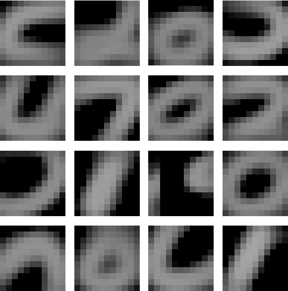

# tf_ConvWTA
Tensorflow implementation of convolutional Winner-Take-All Autoencdoer [1].

## Usage
```python
ae = ConvWTA(sess)

# 1. to train an Autoencoder
loss = ae.loss()
train = optimizer.minimize(loss)
sess.run(train)

# 2. to get the sparse codes
h = ae.encoder(x)
sess.run(h, feed_dict={...})

# 3. to get the reconstructed results
y = ae.reconstruct(x)
sess.run(y, feed_dict={...})

# 4. to get the learned features
f = ae.features() # np.float32 array with shape [11, 11, 1, 16]

# 4-1. to train a different number of features
ae = ConvWTA(sess, num_features=32)

# 5. to save & restore the variables
ae.save(save_path)
ae.restore(save_path)
```

## Result
- MNIST [2]

 

## Reference
- [1] Makhzani, Alireza, and Brendan J. Frey. "Winner-take-all autoencoders." Advances in Neural Information Processing Systems. 2015.
- [2] Y. LeCun, L. Bottou, Y. Bengio, and P. Haffner. "Gradient-based learning applied to document recognition." Proceedings of the IEEE, 86(11):2278-2324, November 1998.

## Author
Inwan Yoo / iwyoo@unist.ac.kr
